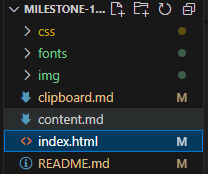
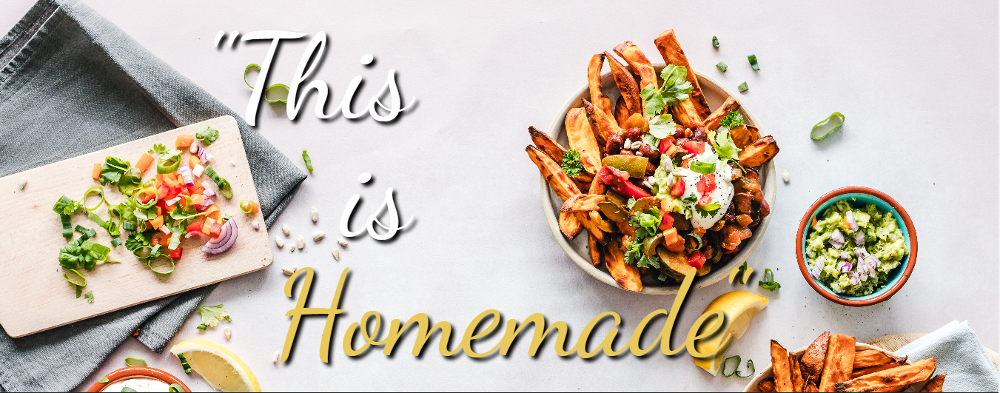

# **[Mama Bunga's Kitchen](https://kitchen.adaapadengancheetah.site)**

# Instructions

Step 1:
First, You must go to **[Mama Bunga's Kitchen](https://kitchen.adaapadengancheetah.site)** site.

Step 2:
Click User logo on the right top. And then Sign in or Sign up.

Step 3:
After Log in, You can look to the menu. You can choose whatever You want to eat or drink by clicking the trolley button next to the menu names, as long as they are available.

Step 4:
You can click the trolley button on the navbar next to User logo to see what You already choosed. You can remove or add another food or beverage.

Step 5:
Choose the shipping or delivery destination. And we will give You an estimation time to get Your order ready to eat/drink.

Step 6:
Choose payment method. And we will start to serve Your order.

If You have any issues, do not hesitate to tell Us via WhatsApp: 0878 8865 3744.

Thank You.

# Stages of Development

1. First, I collect ideas and inspirations.
2. I decided to make a food-and-drink webApp, developing my mother’s brand at the same time.
3. I make a simple wireframe on real paper.
4. I started to make an index.html file, css folder, fonts folder, img folder, and later js folder.
   
5. Open index.html, type `!`, click `enter`, and voila!
6. First I fill in the head (title, icon, and stylesheet).
   
7. Then I made first semantic HTML structures.
   
8. Header:
   
9. Main:
   
10. Footer:
    
11. I planned to make a grid. Then I started to search and collect Photos from the internet.
12. Here is an example of my style.css, how I using nested CSS, and media queries:
    
13. And here is an example of my script.js to make navigation menu available in smaller width screen devices.
    
14. And this is how it looks.
    

# Design Choices

1. **Choose a Logo or a Color Palette or a hero section Picture first.** And I chose the logo below.
   
   This logo is made by my sister for our mother's brand. Actually, I like the logo, especially because it looks elegant with black and yellow-gold, except for the font-family.

2. After I chose the logo, I made a color palette out of it.
   

3. Then I prefer this one:
   
   over this:
   
   Because it looks better for me.

4. I let them like this, because it's not bad according to me.
   
   I just added some text-decoration like this:
   

5. Then I want the font-family of my hero section to be a handwriting font. So I change this:
   
   To this:
   
6. Last, I decided to make the footer as simple as the Expected Output:
   
   
